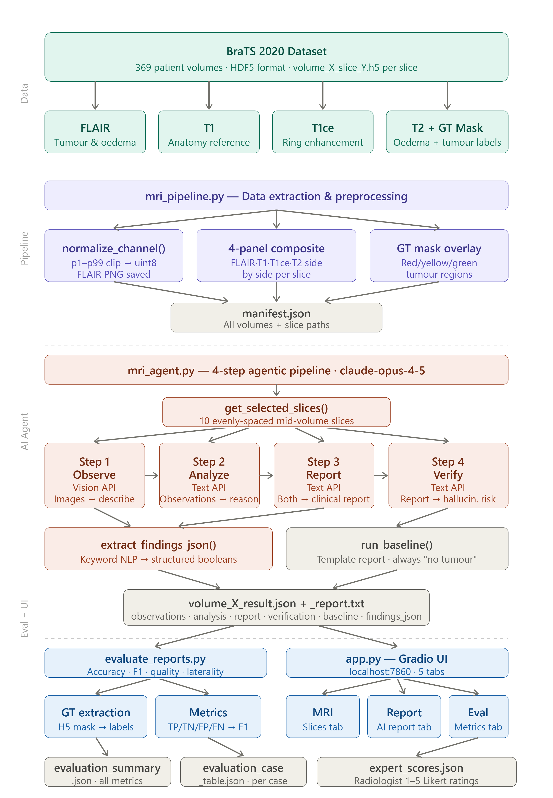
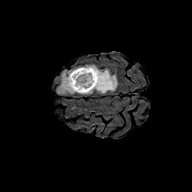
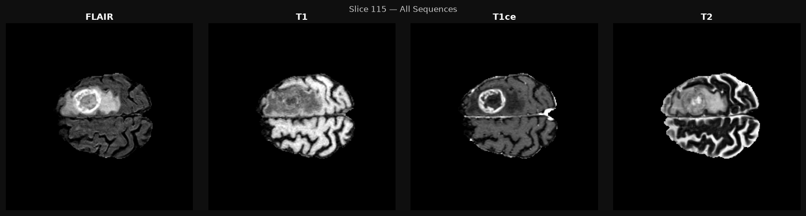
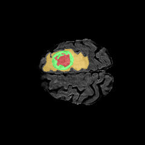

# MRI Report Generation Agent

AI-powered brain tumour radiology report generation using Claude (Anthropic) and the BraTS 2020 dataset.

## What it does

An end-to-end agentic AI pipeline that reads brain MRI scans and automatically generates structured radiology reports using a 4-step pipeline: **Observe → Analyze → Report → Verify**.

## Demo

🎬 [Watch the demo video](<https://github.com/Sobia7590/mri-report-generation-agent/raw/main/MRI%20Report%20Agent%20Demo%20-%20Google%20Chrome%202026-06-15%2012-20-46.mp4>) — click to stream/download (GitHub plays MP4s inline once opened).

## Architecture



## Example Output

| FLAIR input | Multimodal composite | Attention overlay |
|---|---|---|
|  |  |  |

## Results

| Metric | AI Model | Baseline |
|--------|----------|----------|
| Accuracy | 0.95 | 0.00 |
| Precision | 1.00 | 0.00 |
| Recall | 0.95 | 0.00 |
| F1 Score | 0.97 | 0.00 |
| Report Quality | 0.96 | 0.33 |

*"Baseline" is a naive rule-based classifier that always predicts "no tumor." It scores 0 on every metric because the evaluation set is tumor-positive cases, so it never once guesses correctly — it's included to quantify how much the agentic pipeline improves over doing nothing, not as a competing model.*

## Project Structure

- mri_pipeline.py — Data extraction and preprocessing
- mri_agent.py — 4-step Claude agentic pipeline
- evaluate_reports.py — Accuracy and quality evaluation
- app.py — Gradio web UI (localhost:7860)

## Dataset

BraTS 2020 (Brain Tumour Segmentation) — 369 patient volumes, HDF5 format.
Download from: https://www.kaggle.com/datasets/awsaf49/brats20-dataset-training-validation

## Setup

1. Install dependencies:
   ```bash
   pip install anthropic numpy pillow h5py tqdm matplotlib gradio rouge-score
   ```
2. Set your API key:
   ```bash
   export ANTHROPIC_API_KEY="your-key-here"   # macOS/Linux
   set ANTHROPIC_API_KEY=your-key-here         # Windows (cmd)
   ```
3. Run in order:
   ```bash
   python mri_pipeline.py
   python mri_agent.py
   python evaluate_reports.py
   python app.py
   ```

## Tech Stack

- Claude claude-opus-4-5 (Anthropic) — Vision + Language model
- BraTS 2020 — Brain tumour MRI dataset
- Python — h5py, NumPy, Pillow, Gradio
- Gradio — Web UI

## Disclaimer

This is a research prototype. All outputs must be verified by a qualified radiologist before any clinical use.
